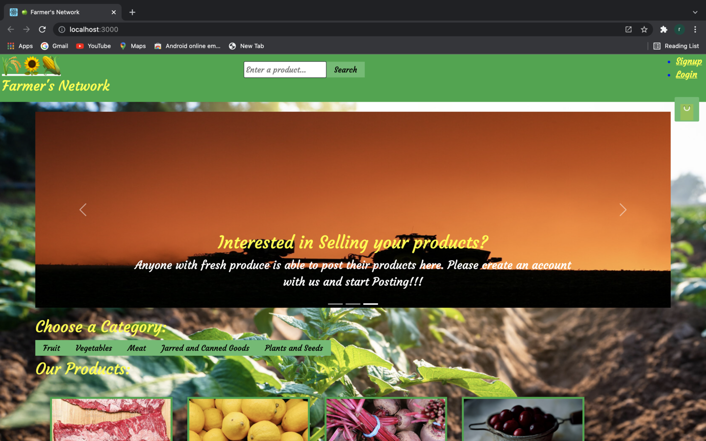
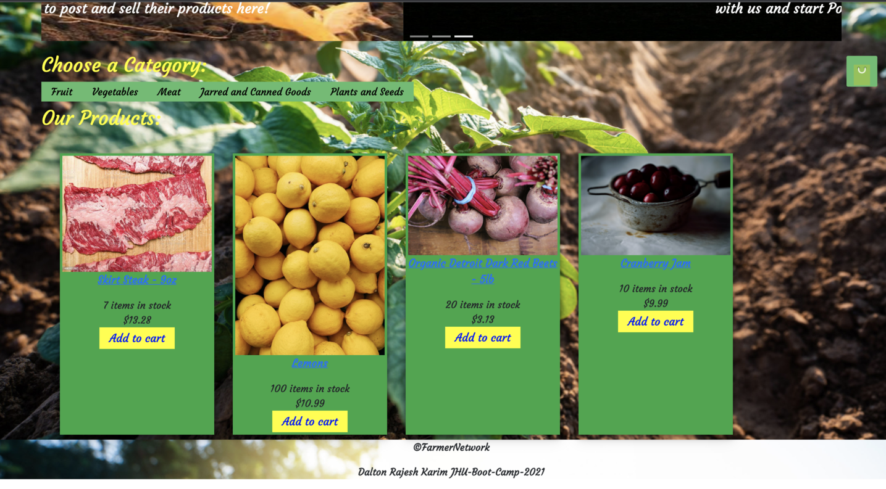
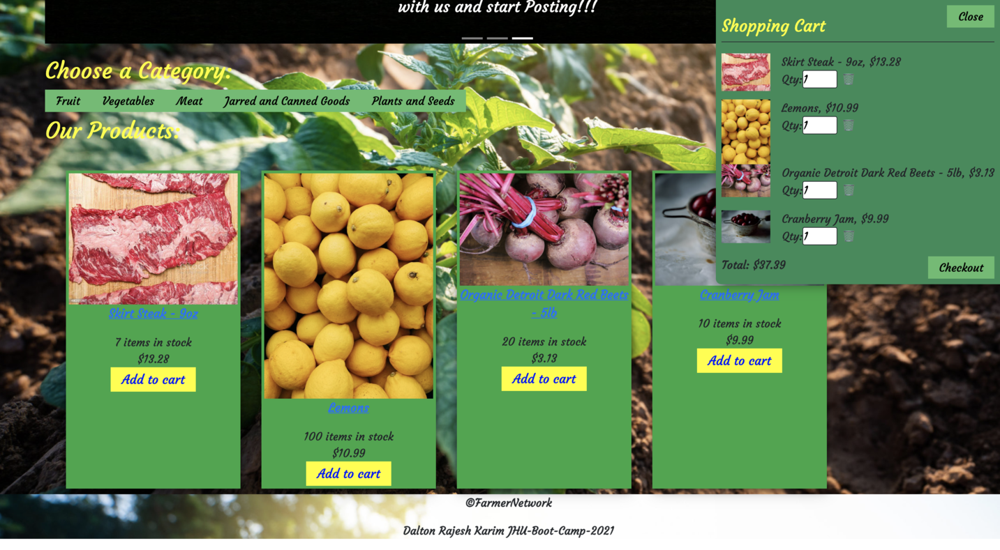

# Farmer's Network

## Description
This is the third JHU Bootcamp team project collaboration, focused on: html, css, javascript, node.js, Express, React, NoSQL, use of a monogoDB database, and responsive web design. The title of our innovative project idea is FarmerNetwork. It is an application that allows a user to search any kind of local farm's product of his/her choice. This app will run in the browser and feature dynamically updated files. This application emphasizes the use of React UI design of front end to provide the better interaction to the farmer to buy and sell their products online, to get information from commercially and locally-available sources and interact with user input data to generate the new avilable local products, information about the resources, and save it for the future overview.

## Technologies:

- [MonogoDb]()-  It stores data with dynamic schema which provides high performance, high availability, and automatic scaling.
- [Express.js](https://expressjs.com/) - Used for application set up of middle ware for end point connection between the front end and backend.
- [React](https://reactjs.org/) - Used as an front-end JavaScript library for building user interfaces and UI components. 
- [Node.js](https://developer.mozilla.org/en-US/docs/Glossary/Node.js?retiredLocale=hu) - Used for package managment and to execute JavaScript code to build command line tool for server-side scripting.
- [Javascript](https://www.javascript.com/) - Used to base functionality of functions and prompts within the application.
- [GitHub]() - Hosts repository that can be deployed to GitHub Pages
- [Jwt Authentication]() -It defines a compact and self-contained way for securely transmitting information between parties as a JSON object.
- [Heroku](https://www.heroku.com) - Heroku is used to deploye the application in the server.
- [Bootstrap](https://getbootstrap.com/) - Used for UI design and additional styling.

## Features

* Each farmer or other individual can sign in and create own profile to upload their products to sell and to post their ideas and concerns. The MongoDB storage is used here to store uploaded and sold productss. For a convenient and clear look, we have made the UI simple and attractive with appropriate css and bootstrap style. 

# Screenshots

## Landing page:

## Login / Sign Up page:

## Uploaded products list page:

 ## Selected items on cart page:

## Links :

* Link for the deployed application: [FarmersNetwork](https://github.com/kgomez1990/FarmersNetwork)
* Link for the Github repository: [Github](https://warm-beach-85460.herokuapp.com/)

## Contributors:
* [Dalton Uhil](https://github.com/duhl91)
* [Karim Gomez](https://github.com/kgomez1990)
* [Rajesh Gautam](https://github.com/Rajesh295-dev)

- - -